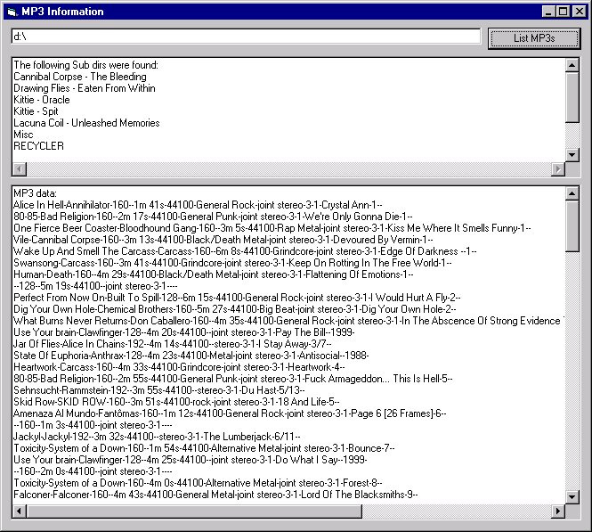



## clsMP3

### Description

A class module that can read ID3v1, ID3v2, and header information from MP3s. Also includes a function for searching dirs for MP3's and subdirs. Can be compiled into an ActiveX Dll for use in ASP or other types of apps. Sample project shows proper use of the class.
 
### More Info
 

             |
---                |---
**Submitted On**   |2002-07-19 17:21:30
**By**             |[Zakk Hoyt](https://github.com/Planet-Source-Code/PSCIndex/blob/master/ByAuthor/zakk-hoyt.md)
**Level**          |Advanced
**User Rating**    |4.4 (35 globes from 8 users)
**Compatibility**  |VB 6\.0
**Category**       |[Sound/MP3](https://github.com/Planet-Source-Code/PSCIndex/blob/master/ByCategory/sound-mp3__1-45.md)
**World**          |[Visual Basic](https://github.com/Planet-Source-Code/PSCIndex/blob/master/ByWorld/visual-basic.md)
**Archive File**   |[clsMP31083947192002\.zip](https://github.com/Planet-Source-Code/zakk-hoyt-clsmp3__1-35224/archive/master.zip)

